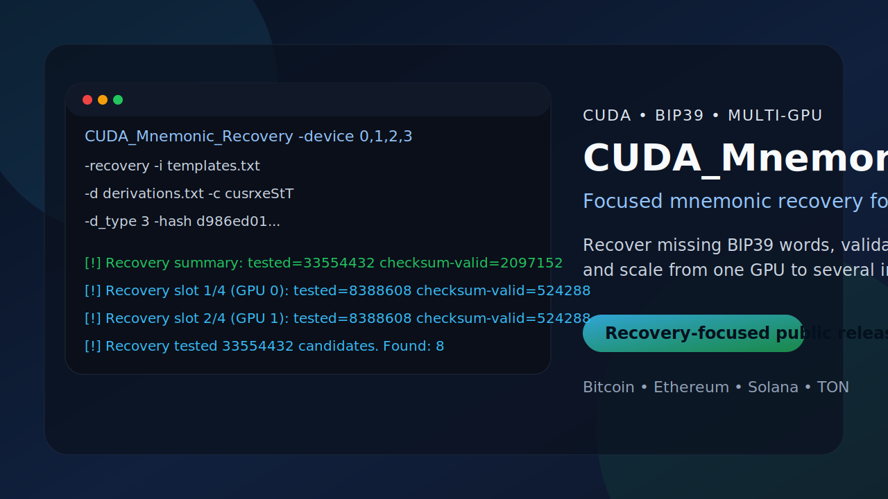
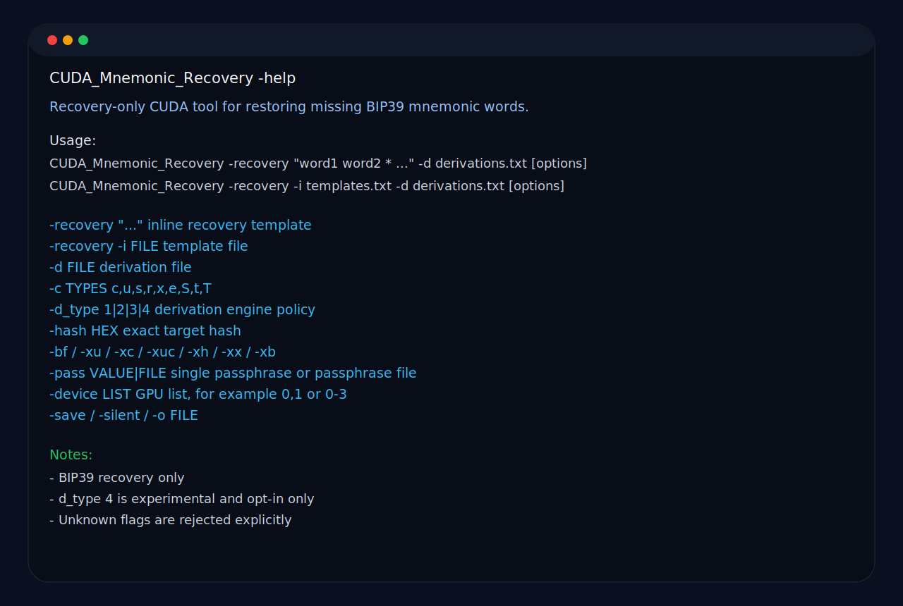
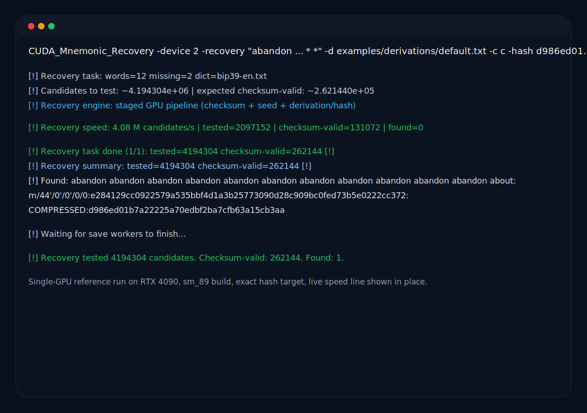
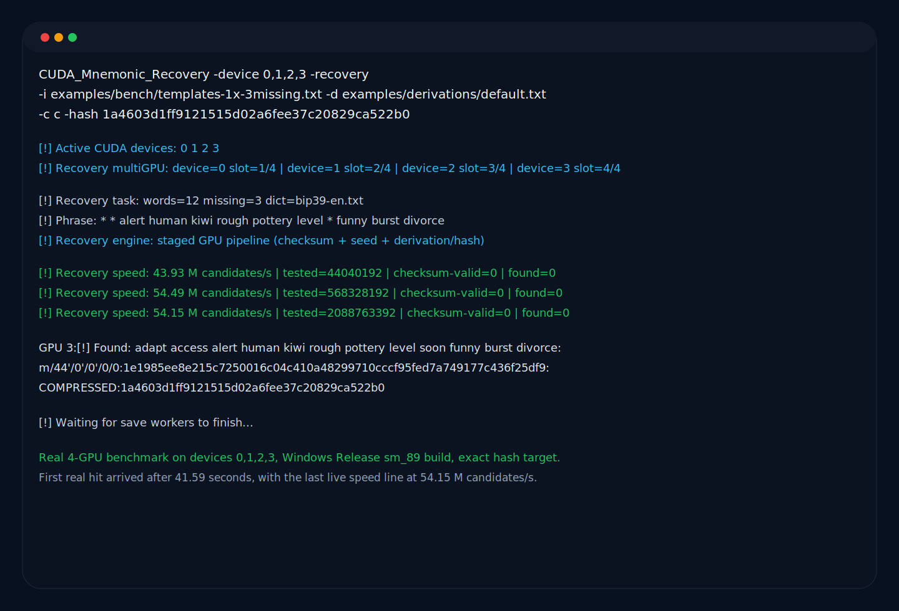
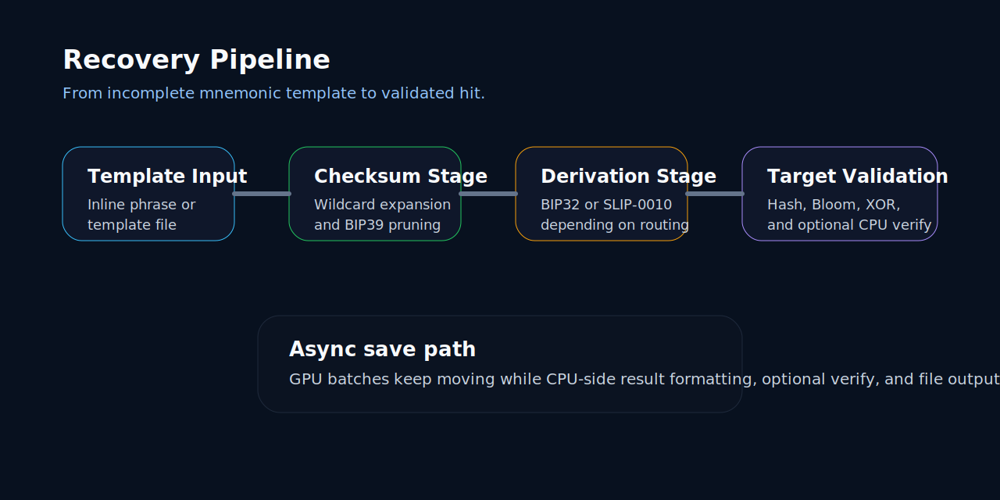
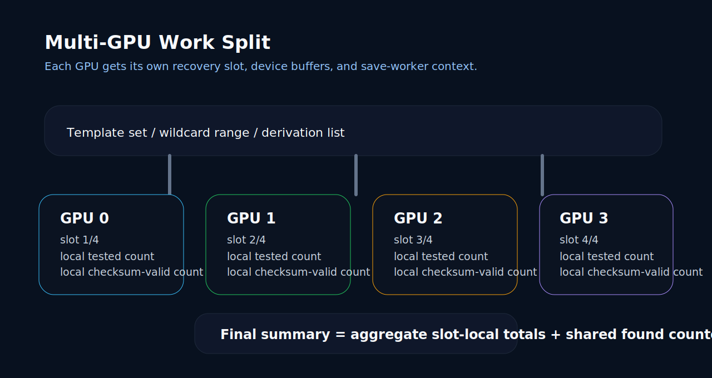

<p align="center">
  <a href="#english"><strong>English</strong></a> |
  <a href="#russian"><strong>Русский</strong></a>
</p>

<a id="english"></a>
<p align="center">
  
</p>

<p align="center">
  
  
  
  
</p>

# CUDA_Mnemonic_Recovery

Author: Mikhail Khoroshavin aka "XopMC"

`CUDA_Mnemonic_Recovery` is a focused CUDA tool for one very specific job: recover incomplete BIP39 mnemonic phrases quickly, validate them against real targets, and keep the workflow clear enough to trust in a real recovery session.

It is built for practical recovery work: real wildcard templates, real derivation lists, real filters, real multi-GPU runs, and output that stays easy to read when a long session is finally producing hits.

## Why This Tool Exists

- You have a real mnemonic backup with missing words marked as `*`.
- You want to validate candidates against exact hashes, Bloom filters, or XOR filters instead of scrolling through noise.
- You want one tool that can check Bitcoin, Ethereum, Solana, and TON-oriented targets from the same recovery flow.
- You want multi-GPU support in a focused, easy-to-follow recovery workflow.

## Visual Tour

### Command Help

<p>
  
</p>

### Single-GPU Recovery

<p>
  
</p>

### Multi-GPU Recovery

<p>
  
</p>

### Recovery Pipeline

<p>
  
</p>

### Multi-GPU Work Split

<p>
  
</p>

## Highlights

- Recover missing BIP39 words with `*` wildcards.
- Work with mnemonic lengths from `3` to `48` words, as long as the phrase length is a multiple of `3`.
- Use embedded BIP39 wordlists or force an external `-wordlist FILE`.
- Auto-pick the matching BIP39 language wordlist and correct common word-entry typos when the intended word is clear.
- Feed templates inline or from files.
- Check candidates against exact `-hash`, Bloom filters, XOR filters, and optional CPU-side verification.
- Build XOR filters with [XorFilter](https://github.com/XopMC/XorFilter) and plug them straight into the recovery flow.
- Select Bitcoin-like, Ethereum, Solana, and TON target families with one CLI.
- Override derivation routing with `-d_type` when wallet behavior does not match the usual coin-native path.
- Run one GPU or several GPUs with the same recovery workflow.
- Keep save/output compact, readable, and practical for long recovery sessions.

## Supported Target Families

`-c` selects which target families are derived and checked.

| Letter | Family | Typical output |
| --- | --- | --- |
| `c` | Compressed | Bitcoin compressed address / hash160 |
| `u` | Uncompressed | Legacy uncompressed address / hash160 |
| `s` | SegWit | P2SH-wrapped SegWit style output |
| `r` | Taproot | Bech32m taproot output |
| `x` | XPoint | X-only/public point style match |
| `e` | Ethereum | Ethereum address / hash |
| `S` | Solana | Solana public address / raw target |
| `t` | TON | Core TON wallet sweep |
| `T` | TON-all | Extended TON wallet sweep |

Any `-c` letters outside this set are rejected in the public release.

## Build

### Windows with CMake

```powershell
cmake --preset windows-release
cmake --build --preset windows-release --config Release
```

### Windows with Visual Studio

```powershell
msbuild CUDA_Mnemonic_Recovery.sln /p:Configuration=Release /p:Platform=x64
```

### Linux / WSL

```bash
make configure
make build
```

### Force a local `sm_89` build

```powershell
cmake --preset windows-release -D CMAKE_CUDA_ARCHITECTURES=89
cmake --build --preset windows-release --config Release
```

Public recovery builds use a `16-bit` secp256k1 precompute window by default.

## Prebuilt GitHub Bundles

GitHub Actions is set up to produce two distribution archives:

- `CUDA_Mnemonic_Recovery-windows-builds.zip`
- `CUDA_Mnemonic_Recovery-linux-builds.tar.gz`

The Linux archive contains these build profiles:

| Profile | Intended cards | Notes |
| --- | --- | --- |
| `sm_61-dlto` | GTX 10xx / Pascal | Dedicated legacy-friendly Linux build |
| `sm_75-dlto` | RTX 20xx / Turing | Best fit for RTX 20xx on Linux |
| `sm_86-dlto` | RTX 30xx / Ampere | Dedicated Ampere Linux build |
| `sm_89-dlto` | RTX 40xx / Ada | Dedicated Ada Linux build |
| `sm_120-dlto` | RTX 50xx / Blackwell | Dedicated Blackwell Linux build |
| `universal-sm_86-sm_120` | RTX 30xx / 40xx / 50xx | One Linux binary for modern cards from `sm_86` through `sm_120` |

The Windows archive contains these build profiles:

| Profile | Intended cards | Notes |
| --- | --- | --- |
| `sm_61` | GTX 10xx / Pascal | Dedicated legacy-friendly Windows build |
| `sm_75` | RTX 20xx / Turing | Best fit for RTX 20xx on Windows |
| `sm_86` | RTX 30xx / Ampere | Dedicated Ampere Windows build |
| `sm_89` | RTX 40xx / Ada | Dedicated Ada Windows build |
| `sm_120` | RTX 50xx / Blackwell | Dedicated Blackwell Windows build |
| `universal-sm_86-sm_120` | RTX 30xx / 40xx / 50xx | One Windows binary for modern cards from `sm_86` through `sm_120` |

Release bundles are built with CUDA `12.8`. Linux dedicated single-architecture profiles use CUDA device link-time optimization (`-dlto`), while the `universal-sm_86-sm_120` build intentionally ships without `-dlto`. Windows release bundles use standard Release device linking for better compatibility on GitHub-hosted runners. CUDA `12.8` still covers `sm_61` and newer profiles, while the universal `sm_86-sm_120` build stays focused on RTX `30xx` through `50xx`. RTX `20xx` remains on the dedicated `sm_75` build.

All public release bundles currently use a `16-bit` secp256k1 precompute window at runtime.

The packaged binaries are prepared to be easy to move between machines:

- Windows builds use the static MSVC runtime and static CUDA runtime.
- Linux builds use the static CUDA runtime plus static `libstdc++` / `libgcc`.
- A compatible NVIDIA driver is still required on the target machine.

## Quick Start

The first commands below all use the same bundled exact-hash fixture, so you can reproduce the run as-is on this repository.

### Recover one missing word from the command line

```bash
CUDA_Mnemonic_Recovery -device 2 -recovery "adapt access alert human kiwi rough pottery level soon funny burst *" -d examples/derivations/default.txt -c c -hash 1a4603d1ff9121515d02a6fee37c20829ca522b0
```

### Recover from a file with template lines

```bash
CUDA_Mnemonic_Recovery -device 2 -recovery -i examples/templates.txt -d examples/derivations/default.txt -c c -hash 1a4603d1ff9121515d02a6fee37c20829ca522b0
```

### Validate against a real exact hash

```bash
CUDA_Mnemonic_Recovery -device 2 -recovery "* * alert human kiwi rough pottery level * funny burst divorce" -d examples/derivations/default.txt -c c -hash 1a4603d1ff9121515d02a6fee37c20829ca522b0
```

### Recover with an XOR filter

```bash
CUDA_Mnemonic_Recovery -recovery -i examples/templates.txt -d examples/derivations/default.txt -xc wallet.xor_c -xx wallet.xor_u -c cus
```

### Recover with passphrases from a file

```bash
CUDA_Mnemonic_Recovery -recovery -i examples/templates.txt -d examples/derivations/default.txt -pass examples/passphrases.txt -c e
```

### Check Solana through BTC-style derivation rules

```bash
CUDA_Mnemonic_Recovery -recovery -i examples/templates.txt -d examples/derivations/default.txt -c S -d_type 1
```

## File Input Formats

### Recovery templates file

Each line is one mnemonic template. Missing words are written as `*`.

Example: [`examples/templates.txt`](./examples/templates.txt)

```text
adapt access alert human kiwi rough pottery level soon funny burst *
adapt access alert human kiwi rough pottery level soon funny * *
```

Rules:

- one template per line
- use spaces between words
- use `*` for every unknown word
- keep the line as a normal mnemonic phrase, only with missing positions replaced
- valid phrase lengths are `3..48` words and must stay divisible by `3`
- the tool auto-detects the matching BIP39 language wordlist
- the parser can correct common typos when the intended BIP39 word is obvious

### Derivations file

Each line is one derivation path.

Example: [`examples/derivations/default.txt`](./examples/derivations/default.txt)

```text
m/44'/0'/0'/0/0
m/49'/0'/0'/0/0
m/84'/0'/0'/0/0
m/86'/0'/0'/0/0
m/44'/60'/0'/0/0
m/44'/501'/0'/0'
m/44'/607'/0'/0/0
```

### Passphrase file

Each line is one passphrase candidate.

Example: [`examples/passphrases.txt`](./examples/passphrases.txt)

```text
TREZOR
wallet-passphrase-example
```

## Command Line Reference

### Recovery sources

| Option | Meaning | Notes |
| --- | --- | --- |
| `-recovery "..."` | Add one template inline | Repeatable |
| `-recovery -i FILE` | Load templates from file | Repeatable |
| `-wordlist FILE` | Override embedded BIP39 wordlist | Must still be a valid 2048-word BIP39 list |
| `-d FILE` | Load derivation paths from file | Required |

### Targets and derivation routing

| Option | Meaning |
| --- | --- |
| `-c TYPES` | Target family selection. Default: `cus` |
| `-d_type 1|2|3|4` | Force derivation engine: `1=bip32-secp256k1`, `2=slip0010-ed25519`, `3=check both`, `4=ed25519-bip32 [TEST]` |

If `-d_type` is omitted, routing stays target-native:

- secp-style targets use the usual BIP32/secp256k1 path
- Solana and TON stay on their native ed25519-oriented route
- `-c` still controls the target family that is generated and checked, even when `-d_type` overrides the derivation engine
- `-d_type 4` is explicit-only, stays on the compatibility evaluator, and is never included in mixed mode
- Live status shows both `candidates/s` and `hashes/s`; hash throughput grows with derivation count, selected targets, and derivation policy

### Filters and direct targets

| Option | Meaning |
| --- | --- |
| `-hash HEX` | Match an exact target hash or raw target prefix in hex |
| `-bf FILE` | Load a Bloom filter. Repeatable |
| `-xu FILE` | Load `.xor_u`, the uncompressed XOR filter format. Repeatable |
| `-xc FILE` | Load `.xor_c`, a compact GPU-side XOR prefilter. Repeatable |
| `-xuc FILE` | Load `.xor_uc`, an even smaller GPU-side XOR prefilter. Repeatable |
| `-xh FILE` | Load `.xor_hc`, the smallest GPU-side XOR prefilter. Repeatable |
| `-xx FILE` | CPU verify using an uncompressed `.xor_u` filter |
| `-xb FILE` | CPU verify with Bloom filter |

`-hash` is a hex input. For classic hash160-based families you usually provide the full 20-byte value. For raw 32-byte targets, the tool consumes a hex prefix, so you typically pass the leading bytes of the raw value.

Target-oriented `-hash` guidance:

- `-c c`, `-c u`, `-c s`, `-c r` expect Bitcoin-style `hash160` in hex.
- `-c x` expects the leading bytes of the raw x-only public key in hex, without `02`, `03`, or `04`.
- `-c e` expects the Ethereum address in hex, without `0x`.
- `-c S` expects the leading bytes of the raw ed25519 public key in hex, which means the Solana address must be decoded from base58 first.
- `-c t` and `-c T` expect the leading bytes of the raw TON account hash in hex, without the `<workchain:>` prefix.

Practical BTC-style exact hash example:

```bash
CUDA_Mnemonic_Recovery -device 2 -recovery "adapt access alert human kiwi rough pottery level soon funny burst *" -d examples/derivations/default.txt -c c -hash 1a4603d1ff9121515d02a6fee37c20829ca522b0
```

### Bloom filters

`CUDA_Mnemonic_Recovery` accepts Bloom filters compatible with the formats used by [brainflayer](https://github.com/ryancdotorg/brainflayer) and [Mnemonic_CPP](https://github.com/XopMC/Mnemonic_CPP).

You can add several Bloom filters by repeating `-bf`:

```bash
CUDA_Mnemonic_Recovery -recovery -i examples/templates.txt -d examples/derivations/default.txt -bf wallet_a.blf -bf wallet_b.blf -c c
```

## XOR Filters and XorFilter

If you want XOR filters for this project, generate them with [XorFilter](https://github.com/XopMC/XorFilter).

Recommended workflow:

- `.xor_u` is the only XOR format recommended for a full standalone run without extra CPU confirmation.
- `.xor_c`, `.xor_uc`, and `.xor_hc` are compact GPU prefilters. They are excellent for reducing memory and accelerating broad scans, but they should not be treated as the final truth in a full recovery session.
- For `.xor_c`, `.xor_uc`, and `.xor_hc`, add `-xx wallet.xor_u` so the survivors are rechecked on the CPU against an uncompressed `.xor_u` filter.
- You can load several XOR filters of the same family by repeating the corresponding flag.

Practical example:

```bash
CUDA_Mnemonic_Recovery -recovery -i examples/templates.txt -d examples/derivations/default.txt -xc wallet.xor_c -xx wallet.xor_u -c cus
```

Multi-filter example:

```bash
CUDA_Mnemonic_Recovery -recovery -i examples/templates.txt -d examples/derivations/default.txt -xc wallet_a.xor_c -xc wallet_b.xor_c -xx wallet_master.xor_u -c cus
```

That pattern gives you a compact GPU filter on the front end and a precise CPU re-check on the back end.

### Runtime and output

| Option | Meaning |
| --- | --- |
| `-pbkdf N` | Override PBKDF2 iteration count. Default: `2048` |
| `-pass VALUE\|FILE` | Use one passphrase string or a passphrase file |
| `-device LIST` | Use one or more GPUs, for example `2`, `2,3`, `0-3` |
| `-b N` | Force CUDA blocks |
| `-t N` | Force CUDA threads per block |
| `-fsize N` | Found-buffer capacity |
| `-o FILE` | Output file. Default: `result.txt` |
| `-save` | Save address-oriented output instead of raw match hash |
| `-silent` | Suppress console hit printing |
| `-h`, `-help` | Show public help |

## Understanding `-save`

The tool keeps compact colon-separated `Found` lines.

Without `-save`, the last field is the raw matched hash/target bytes:

```text
[!] Found: <mnemonic>:<derivation>:<private_key_hex>:COMPRESSED:<matched_hash>
```

With `-save`, the last field becomes the address-oriented output instead:

```text
[!] Found: <mnemonic>:<derivation>:<private_key_hex>:COMPRESSED:<address>
```

What stays the same:

- the private key is still written
- the derivation path is still written
- the coin/type label is still written

What changes:

- raw hash output becomes address-oriented output
- compressed Bitcoin emits an additional `P2WPKH` line

Examples:

```text
[!] Found: ...:COMPRESSED:1LqBGSKuX5yYUonjxT5qGfpUsXKYYWeabA
[!] Found: ...:P2WPKH:bc1qmxrw6qdh5g3ztfcwm0et5l8mvws4eva24kmp8m
[!] Found: ...:ETH:0x9858effd232b4033e47d90003d41ec34ecaeda94
[!] Found: ...:SOLANA:EHqmfkN89RJ7Y33CXM6uCzhVeuywHoJXZZLszBHHZy7o
```

In mixed derivation runs, non-default derivation engines are annotated next to the derivation path, not in the coin label:

```text
[!] Found: ...:(bip32-secp256k1) m/44'/501'/0'/0':<private_key>:SOLANA:<value>
```

## Multi-GPU

Multi-GPU mode is enabled through `-device LIST`.

Examples:

```bash
CUDA_Mnemonic_Recovery -device 2,3 -recovery -i examples/templates.txt -d examples/derivations/default.txt -c c
CUDA_Mnemonic_Recovery -device 0-3 -recovery -i examples/templates.txt -d examples/derivations/default.txt -c cusrxeStT
```

What the tool does in multi-GPU mode:

- initializes one recovery slot per selected GPU
- splits the recovery workload across slots
- keeps per-slot accounting
- aggregates final tested / checksum-valid totals
- keeps async save workers alive until the end of the run

### Real local benchmark

The numbers below were measured on this machine after fixing the staged multi-GPU path. This benchmark uses:

- mnemonic: `adapt access alert human kiwi rough pottery level soon funny burst divorce`
- derivations: [`examples/derivations/default.txt`](./examples/derivations/default.txt)
- target family: `-c c`
- exact hash target: `1a4603d1ff9121515d02a6fee37c20829ca522b0`
- build: Windows Release, `sm_89`
- measurement rule: end-to-end wall-clock until the first real `[!] Found:` line
- hardware: `4x RTX 4090`
- power limit: all four GPUs were capped to `50% TDP` with MSI Afterburner
- note: at `100% TDP`, the absolute speed will be higher than the numbers in this table

Benchmark fixture:

- [`examples/bench/templates-1x-3missing.txt`](./examples/bench/templates-1x-3missing.txt)

Command pattern:

```bash
CUDA_Mnemonic_Recovery -device <LIST> -recovery -i examples/bench/templates-1x-3missing.txt -d examples/derivations/default.txt -c c -hash 1a4603d1ff9121515d02a6fee37c20829ca522b0
```

Measured results:

| GPUs | Devices | Workload | Wall-clock to first hit | Last live speed before hit |
| --- | --- | --- | --- | --- |
| `1` | `2` | `1 template`, `3 missing words`, exact hash | `550.07 s` | `12.53 M candidates/s` |
| `2` | `0,2` | same | `211.58 s` | `26.87 M candidates/s` |
| `4` | `0,1,2,3` | same | `41.59 s` | `54.15 M candidates/s` |

Measured wall-clock speedup from the same fixture:

- `2 GPU`: about `2.60x`
- `4 GPU`: about `13.23x`

### Stress case: 4 missing words

The stress fixture is separate on purpose:

- [`examples/bench/templates-1x-4missing.txt`](./examples/bench/templates-1x-4missing.txt)

Command pattern:

```bash
CUDA_Mnemonic_Recovery -device <LIST> -recovery -i examples/bench/templates-1x-4missing.txt -d examples/derivations/default.txt -c c -hash 1a4603d1ff9121515d02a6fee37c20829ca522b0
```

Measured result:

| Scenario | Result |
| --- | --- |
| `1 GPU`, device `2`, same exact hash, `10 minute` limit | no hit within `600.37 s` |
| `4 GPU`, devices `0,1,2,3`, same exact hash | first hit in `15.75 s`, last live speed `56.42 M candidates/s` |

Extra fixtures in this repository:

- [`examples/bench/templates-8x-2missing.txt`](./examples/bench/templates-8x-2missing.txt) is still useful as a short smoke test for counters and output formatting
- [`examples/bench/templates-8x-3missing.txt`](./examples/bench/templates-8x-3missing.txt) remains a heavier batch-style fixture if you want a longer non-showcase run

## Troubleshooting

### The tool says `-d FILE is required`

That is expected. Public documentation assumes explicit derivation files for recovery runs.

### I want to recover from a file instead of typing the phrase

Use:

```bash
CUDA_Mnemonic_Recovery -recovery -i examples/templates.txt -d examples/derivations/default.txt
```

### My wallet uses unusual derivation logic

Try `-d_type`:

- `-d_type 1` for forced BIP32/secp256k1
- `-d_type 2` for forced SLIP-0010 ed25519
- `-d_type 3` to try both
- `-d_type 4` for experimental `ed25519-bip32` checks only

### `-save` does not show the raw hash anymore

That is by design. `-save` switches the last field to address-oriented output.

### Can I use several GPUs?

Yes. Use `-device LIST`, for example:

```bash
-device 2,3
-device 0-3
```

## Repository Layout

- `src/app/` entry point, CLI, config
- `src/recovery/` recovery pipeline and host-side runtime
- `src/crypto/` mnemonic, TON, filters, hashes
- `src/cuda/` CUDA recovery workers and device control
- `include/` project headers
- `support/` shared host utilities
- `third_party/` bundled crypto and PBKDF2 code
- `assets/wordlists/` source BIP39 wordlists
- `examples/` ready-to-run sample inputs
- `docs/media/` README visuals and social preview assets

## Responsible Use

This project is intended only for legitimate recovery of wallets, backups, and seed phrases that belong to you or that you are explicitly authorized to recover.

The author strongly discourages any malicious use of this software. Any unlawful or abusive use is entirely the responsibility of the user. See [`RESPONSIBLE_USE.md`](./RESPONSIBLE_USE.md) for the short lawful-use policy and [`SECURITY.md`](./SECURITY.md) for private vulnerability reporting guidance.

## Custom Development

I build custom software on request. If you want changes, extensions, or project-specific adaptations for `CUDA_Mnemonic_Recovery`, you can discuss them with me on Telegram:

- https://t.me/xopmc

This public release is also an example of the kind of performance-oriented software and recovery tooling I can design and implement.

---

<a id="russian"></a>

## Русский

Автор: Mikhail Khoroshavin aka "XopMC"

`CUDA_Mnemonic_Recovery` — это узкоспециализированный CUDA-инструмент для одной конкретной задачи: восстановления неполных BIP39 mnemonic-фраз с реальной проверкой кандидатов по нужным целям.

Он рассчитан на практическую работу: реальные wildcard-шаблоны, реальные derivation-path’ы, реальные фильтры, реальные MultiGPU-запуски и вывод, который остаётся удобным даже в длинной сессии восстановления.

## Для Чего Этот Проект

- У вас есть реальная BIP39-фраза, где часть слов потеряна и заменена на `*`.
- Вы хотите проверять кандидатов не вручную, а по реальному `-hash`, Bloom/XOR-фильтрам или CPU verify.
- Вам нужен один recovery flow для Bitcoin, Ethereum, Solana и TON.
- Вам нужна MultiGPU-поддержка в понятном и сфокусированном recovery workflow.

## Визуальный Обзор

### Меню Помощи

<p>
  
</p>

### Обычный Recovery Запуск

<p>
  
</p>

### Multi-GPU Recovery

<p>
  
</p>

### Схема Recovery Pipeline

<p>
  
</p>

### Схема Multi-GPU Разделения Нагрузки

<p>
  
</p>

## Что Умеет Проект

- Восстанавливать BIP39-фразы с пропущенными словами `*`.
- Работать с фразами длиной от `3` до `48` слов, если общее число слов кратно `3`.
- Использовать встроенные словари BIP39 или внешний `-wordlist FILE`.
- Автоматически подбирать подходящий языковой BIP39-словарь и исправлять типичные опечатки в словах, когда нужное слово определяется однозначно.
- Принимать шаблоны как из командной строки, так и из файлов.
- Проверять кандидатов по `-hash`, Bloom-фильтрам, XOR-фильтрам и optional CPU verify.
- Создавать XOR-фильтры с помощью [XorFilter](https://github.com/XopMC/XorFilter) и сразу использовать их в recovery flow.
- Работать с target-семействами Bitcoin-like, Ethereum, Solana и TON.
- Переопределять тип derivation через `-d_type`, если кошелёк использует не стандартную схему.
- Работать на одной GPU или сразу на нескольких.
- Получать компактный и практичный `Found` вывод, удобный для длинных recovery-сессий.

## Поддерживаемые Target Families

`-c` задаёт, какие именно целевые семейства нужно строить и проверять.

| Буква | Семейство | Что обычно получается |
| --- | --- | --- |
| `c` | Compressed | Bitcoin compressed address / hash160 |
| `u` | Uncompressed | Legacy uncompressed address / hash160 |
| `s` | SegWit | P2SH-wrapped SegWit style output |
| `r` | Taproot | Bech32m taproot output |
| `x` | XPoint | X-only/public point style match |
| `e` | Ethereum | Ethereum address / hash |
| `S` | Solana | Solana public address / raw target |
| `t` | TON | Базовый sweep по TON |
| `T` | TON-all | Расширенный sweep по TON |

Любые другие буквы в `-c` в публичной версии отвергаются.

## Сборка

### Windows через CMake

```powershell
cmake --preset windows-release
cmake --build --preset windows-release --config Release
```

### Windows через Visual Studio

```powershell
msbuild CUDA_Mnemonic_Recovery.sln /p:Configuration=Release /p:Platform=x64
```

### Linux / WSL

```bash
make configure
make build
```

### Локальная сборка только под `sm_89`

```powershell
cmake --preset windows-release -D CMAKE_CUDA_ARCHITECTURES=89
cmake --build --preset windows-release --config Release
```

Публичные recovery-сборки по умолчанию используют `16-bit` окно secp256k1 precompute.

## Готовые GitHub-Сборки

GitHub Actions подготавливает два дистрибутивных архива:

- `CUDA_Mnemonic_Recovery-windows-builds.zip`
- `CUDA_Mnemonic_Recovery-linux-builds.tar.gz`

В Linux-архиве лежат такие профили:

| Профиль | Для каких карт | Примечание |
| --- | --- | --- |
| `sm_61-dlto` | GTX 10xx / Pascal | Отдельная Linux-сборка для Pascal |
| `sm_75-dlto` | RTX 20xx / Turing | Лучший выбор для RTX 20xx под Linux |
| `sm_86-dlto` | RTX 30xx / Ampere | Отдельная Linux-сборка под Ampere |
| `sm_89-dlto` | RTX 40xx / Ada | Отдельная Linux-сборка под Ada |
| `sm_120-dlto` | RTX 50xx / Blackwell | Отдельная Linux-сборка под Blackwell |
| `universal-sm_86-sm_120` | RTX 30xx / 40xx / 50xx | Один Linux-бинарник для `sm_86`...`sm_120` |

В Windows-архиве лежат такие профили:

| Профиль | Для каких карт | Примечание |
| --- | --- | --- |
| `sm_61` | GTX 10xx / Pascal | Отдельная Windows-сборка для Pascal |
| `sm_75` | RTX 20xx / Turing | Лучший выбор для RTX 20xx под Windows |
| `sm_86` | RTX 30xx / Ampere | Отдельная Windows-сборка под Ampere |
| `sm_89` | RTX 40xx / Ada | Отдельная Windows-сборка под Ada |
| `sm_120` | RTX 50xx / Blackwell | Отдельная Windows-сборка под Blackwell |
| `universal-sm_86-sm_120` | RTX 30xx / 40xx / 50xx | Один Windows-бинарник для `sm_86`...`sm_120` |

Release-сборки делаются на CUDA `12.8`. Для отдельных Linux single-arch профилей `CUDA device link-time optimization` (`-dlto`) остаётся включённым, а для `universal-sm_86-sm_120` он специально отключён. Windows release-пакеты используют обычный Release device linking ради стабильной сборки на GitHub-hosted runners. CUDA `12.8` всё ещё покрывает `sm_61`, а универсальная сборка `sm_86-sm_120` остаётся сфокусированной на RTX `30xx`...`50xx`. Для RTX `20xx` остаётся отдельный профиль `sm_75`.

Во всех публичных release bundle’ах сейчас используется `16-bit` окно secp256k1 precompute на runtime-уровне.

Пакеты подготовлены так, чтобы их было удобно переносить между машинами:

- Windows-сборки используют статический MSVC runtime и статический CUDA runtime.
- Linux-сборки используют статический CUDA runtime и статические `libstdc++` / `libgcc`.
- Совместимый NVIDIA driver на целевой машине всё равно обязателен.

## Быстрый Старт

Первые команды ниже используют один и тот же exact-hash fixture из репозитория, так что их можно воспроизвести как есть.

### Восстановление одного пропущенного слова из командной строки

```bash
CUDA_Mnemonic_Recovery -device 2 -recovery "adapt access alert human kiwi rough pottery level soon funny burst *" -d examples/derivations/default.txt -c c -hash 1a4603d1ff9121515d02a6fee37c20829ca522b0
```

### Восстановление из файла с шаблонами

```bash
CUDA_Mnemonic_Recovery -device 2 -recovery -i examples/templates.txt -d examples/derivations/default.txt -c c -hash 1a4603d1ff9121515d02a6fee37c20829ca522b0
```

### Проверка по реальному точному hash target

```bash
CUDA_Mnemonic_Recovery -device 2 -recovery "* * alert human kiwi rough pottery level * funny burst divorce" -d examples/derivations/default.txt -c c -hash 1a4603d1ff9121515d02a6fee37c20829ca522b0
```

### Проверка через XOR filter

```bash
CUDA_Mnemonic_Recovery -recovery -i examples/templates.txt -d examples/derivations/default.txt -xc wallet.xor_c -xx wallet.xor_u -c cus
```

### Recovery с passphrase из файла

```bash
CUDA_Mnemonic_Recovery -recovery -i examples/templates.txt -d examples/derivations/default.txt -pass examples/passphrases.txt -c e
```

### Проверка Solana через BTC-style derivation

```bash
CUDA_Mnemonic_Recovery -recovery -i examples/templates.txt -d examples/derivations/default.txt -c S -d_type 1
```

## Форматы Входных Файлов

### Файл шаблонов восстановления

Каждая строка — это один mnemonic-шаблон. Пропущенные слова помечаются как `*`.

Пример: [`examples/templates.txt`](./examples/templates.txt)

```text
adapt access alert human kiwi rough pottery level soon funny burst *
adapt access alert human kiwi rough pottery level soon funny * *
```

Правила:

- одна фраза на строку
- слова разделяются пробелами
- каждый неизвестный слот — это отдельный `*`
- строка должна выглядеть как обычная mnemonic-фраза, только с заменой неизвестных слов на `*`
- допустимая длина фразы — от `3` до `48` слов, при этом число слов должно быть кратно `3`
- инструмент автоматически подбирает подходящий языковой BIP39-словарь
- парсер умеет исправлять типичные опечатки, если нужное слово определяется однозначно

### Файл derivation-path’ов

Каждая строка — это один derivation path.

Пример: [`examples/derivations/default.txt`](./examples/derivations/default.txt)

```text
m/44'/0'/0'/0/0
m/49'/0'/0'/0/0
m/84'/0'/0'/0/0
m/86'/0'/0'/0/0
m/44'/60'/0'/0/0
m/44'/501'/0'/0'
m/44'/607'/0'/0/0
```

### Файл passphrase

Каждая строка — это одна passphrase.

Пример: [`examples/passphrases.txt`](./examples/passphrases.txt)

```text
TREZOR
wallet-passphrase-example
```

## Справка По Аргументам

### Источники recovery-входа

| Аргумент | Что делает | Примечание |
| --- | --- | --- |
| `-recovery "..."` | Добавляет один шаблон прямо из CLI | Можно повторять |
| `-recovery -i FILE` | Загружает шаблоны из файла | Можно повторять |
| `-wordlist FILE` | Подменяет встроенный словарь BIP39 | Должен быть корректный 2048-word BIP39 список |
| `-d FILE` | Загружает derivation-path’ы | Обязательный аргумент |

### Цели и тип derivation

| Аргумент | Что делает |
| --- | --- |
| `-c TYPES` | Выбор target families. По умолчанию `cus` |
| `-d_type 1|2|3|4` | Переопределяет derivation engine: `1=bip32-secp256k1`, `2=slip0010-ed25519`, `3=оба варианта`, `4=ed25519-bip32 [TEST]` |

Если `-d_type` не указан, остаётся target-native логика:

- secp-ориентированные цели идут через обычный BIP32/secp256k1
- Solana и TON остаются на своём native ed25519-маршруте
- `-c` при этом всё равно задаёт именно target family, которую нужно строить и проверять
- `-d_type 4` включается только явно, всегда идёт через compatibility path и не входит в mixed-режим
- В live status показываются и `candidates/s`, и `hashes/s`; hash throughput растёт вместе с числом derivations, выбранных целей и derivation policy

### Filters и direct targets

| Аргумент | Что делает |
| --- | --- |
| `-hash HEX` | Проверка по точному hash или raw target prefix в hex |
| `-bf FILE` | Загружает Bloom filter. Аргумент можно повторять |
| `-xu FILE` | Загружает `.xor_u`, несжатый формат XOR filter. Аргумент можно повторять |
| `-xc FILE` | Загружает `.xor_c`, компактный GPU-side XOR prefilter. Аргумент можно повторять |
| `-xuc FILE` | Загружает `.xor_uc`, ещё более компактный GPU-side XOR prefilter. Аргумент можно повторять |
| `-xh FILE` | Загружает `.xor_hc`, самый компактный GPU-side XOR prefilter. Аргумент можно повторять |
| `-xx FILE` | CPU verify через несжатый `.xor_u` filter |
| `-xb FILE` | CPU verify через Bloom filter |

`-hash` принимает hex-строку. Для classic hash160-семейств обычно используется весь 20-byte hash. Для raw 32-byte targets инструмент работает как prefix matcher, поэтому обычно передаются начальные байты raw значения.

Практическая подсказка по `-hash` для `-c`:

- `-c c`, `-c u`, `-c s`, `-c r` ждут Bitcoin-style `hash160` в hex.
- `-c x` ждёт начальные байты raw x-only публичного ключа в hex, без `02`, `03` и `04`.
- `-c e` ждёт Ethereum address в hex без `0x`.
- `-c S` ждёт начальные байты raw ed25519 public key в hex, то есть Solana-адрес нужно сначала декодировать из base58.
- `-c t` и `-c T` ждут начальные байты raw TON account hash в hex, без `<workchain:>`.

Практический BTC-style пример с точным hash:

```bash
CUDA_Mnemonic_Recovery -device 2 -recovery "adapt access alert human kiwi rough pottery level soon funny burst *" -d examples/derivations/default.txt -c c -hash 1a4603d1ff9121515d02a6fee37c20829ca522b0
```

### Bloom filters

`CUDA_Mnemonic_Recovery` принимает Bloom-фильтры, совместимые с форматами, которые используют [brainflayer](https://github.com/ryancdotorg/brainflayer) и [Mnemonic_CPP](https://github.com/XopMC/Mnemonic_CPP).

Можно подключать несколько Bloom-фильтров, просто повторяя `-bf`:

```bash
CUDA_Mnemonic_Recovery -recovery -i examples/templates.txt -d examples/derivations/default.txt -bf wallet_a.blf -bf wallet_b.blf -c c
```

## XOR Фильтры И XorFilter

Если вам нужны XOR-фильтры для этого проекта, создавать их лучше через [XorFilter](https://github.com/XopMC/XorFilter).

Рекомендуемая схема:

- `.xor_u` — единственный XOR-формат, который подходит как финальный standalone-вариант без дополнительной CPU-проверки.
- `.xor_c`, `.xor_uc` и `.xor_hc` — это компактные GPU-side prefilter’ы. Они отлично подходят для экономии памяти и ускорения широкого сканирования, но их нельзя считать финальной истиной в полноценной recovery-сессии.
- Для `.xor_c`, `.xor_uc` и `.xor_hc` добавляйте `-xx wallet.xor_u`, чтобы прошедшие кандидаты перепроверялись на CPU по несжатому `.xor_u`.
- Несколько XOR-фильтров одного семейства можно подключать повторением соответствующего флага.

Практический пример:

```bash
CUDA_Mnemonic_Recovery -recovery -i examples/templates.txt -d examples/derivations/default.txt -xc wallet.xor_c -xx wallet.xor_u -c cus
```

Пример с несколькими XOR-фильтрами:

```bash
CUDA_Mnemonic_Recovery -recovery -i examples/templates.txt -d examples/derivations/default.txt -xc wallet_a.xor_c -xc wallet_b.xor_c -xx wallet_master.xor_u -c cus
```

Такой шаблон даёт компактный GPU-фильтр на входе и точную CPU-перепроверку на выходе.

### Runtime и вывод

| Аргумент | Что делает |
| --- | --- |
| `-pbkdf N` | Переопределяет число PBKDF2 итераций. По умолчанию `2048` |
| `-pass VALUE\|FILE` | Одна passphrase строкой или файл passphrase |
| `-device LIST` | Выбор одной или нескольких GPU, например `2`, `2,3`, `0-3` |
| `-b N` | Принудительное число CUDA blocks |
| `-t N` | Принудительное число threads per block |
| `-fsize N` | Размер found-buffer |
| `-o FILE` | Файл результатов. По умолчанию `result.txt` |
| `-save` | Переключает последний столбец с raw hash на адресный вывод |
| `-silent` | Не печатать hits в консоль |
| `-h`, `-help` | Показать публичное help-меню |

## Как Работает `-save`

Инструмент сохраняет компактные `Found` строки в плоском формате через `:`.

Без `-save` последний сегмент строки — это raw matched hash/target bytes:

```text
[!] Found: <mnemonic>:<derivation>:<private_key_hex>:COMPRESSED:<matched_hash>
```

С `-save` последний сегмент становится адресно-ориентированным:

```text
[!] Found: <mnemonic>:<derivation>:<private_key_hex>:COMPRESSED:<address>
```

Что остаётся всегда:

- приватный ключ
- путь деривации
- label типа/монеты

Что меняется:

- raw hash заменяется на адресный вывод
- для compressed Bitcoin добавляется дополнительная строка `P2WPKH`

Примеры:

```text
[!] Found: ...:COMPRESSED:1LqBGSKuX5yYUonjxT5qGfpUsXKYYWeabA
[!] Found: ...:P2WPKH:bc1qmxrw6qdh5g3ztfcwm0et5l8mvws4eva24kmp8m
[!] Found: ...:ETH:0x9858effd232b4033e47d90003d41ec34ecaeda94
[!] Found: ...:SOLANA:EHqmfkN89RJ7Y33CXM6uCzhVeuywHoJXZZLszBHHZy7o
```

В mixed-режиме non-default derivation engine помечается рядом с derivation path, а не внутри названия монеты:

```text
[!] Found: ...:(bip32-secp256k1) m/44'/501'/0'/0':<private_key>:SOLANA:<value>
```

## Multi-GPU

Multi-GPU включается через `-device LIST`.

Примеры:

```bash
CUDA_Mnemonic_Recovery -device 2,3 -recovery -i examples/templates.txt -d examples/derivations/default.txt -c c
CUDA_Mnemonic_Recovery -device 0-3 -recovery -i examples/templates.txt -d examples/derivations/default.txt -c cusrxeStT
```

Что делает инструмент в multi-GPU режиме:

- создаёт отдельный recovery slot на каждую выбранную GPU
- делит workload между слотами
- ведёт per-slot статистику
- агрегирует итоговые tested / checksum-valid totals
- сохраняет async save workers до конца выполнения

### Реальный локальный benchmark

Цифры ниже сняты на этой машине уже после фикса staged multi-GPU path. Для benchmark использовались:

- мнемоника: `adapt access alert human kiwi rough pottery level soon funny burst divorce`
- derivations: [`examples/derivations/default.txt`](./examples/derivations/default.txt)
- target family: `-c c`
- exact hash target: `1a4603d1ff9121515d02a6fee37c20829ca522b0`
- сборка: Windows Release, `sm_89`
- правило измерения: полный wall-clock до первой реальной строки `[!] Found:`
- железо: `4x RTX 4090`
- ограничение питания: все четыре карты были ограничены до `50% TDP` через MSI Afterburner
- примечание: при `100% TDP` абсолютная скорость будет выше, чем в этой таблице

Основной benchmark-fixture:

- [`examples/bench/templates-1x-3missing.txt`](./examples/bench/templates-1x-3missing.txt)

Шаблон команды:

```bash
CUDA_Mnemonic_Recovery -device <LIST> -recovery -i examples/bench/templates-1x-3missing.txt -d examples/derivations/default.txt -c c -hash 1a4603d1ff9121515d02a6fee37c20829ca522b0
```

Измеренные результаты:

| GPU | Устройства | Нагрузка | Wall-clock до первого hit | Последняя live speed line перед hit |
| --- | --- | --- | --- | --- |
| `1` | `2` | `1 шаблон`, `3 пропущенных слова`, exact hash | `550.07 s` | `12.53 M candidates/s` |
| `2` | `0,2` | то же самое | `211.58 s` | `26.87 M candidates/s` |
| `4` | `0,1,2,3` | то же самое | `41.59 s` | `54.15 M candidates/s` |

Измеренное ускорение по wall-clock на этом же fixture:

- `2 GPU`: около `2.60x`
- `4 GPU`: около `13.23x`

### Stress-кейс: 4 пропущенных слова

Для stress-сценария используется отдельный fixture:

- [`examples/bench/templates-1x-4missing.txt`](./examples/bench/templates-1x-4missing.txt)

Шаблон команды:

```bash
CUDA_Mnemonic_Recovery -device <LIST> -recovery -i examples/bench/templates-1x-4missing.txt -d examples/derivations/default.txt -c c -hash 1a4603d1ff9121515d02a6fee37c20829ca522b0
```

Измеренный результат:

| Сценарий | Результат |
| --- | --- |
| `1 GPU`, устройство `2`, тот же exact hash, лимит `10 минут` | hit не найден за `600.37 s` |
| `4 GPU`, устройства `0,1,2,3`, тот же exact hash | первый hit через `15.75 s`, последняя live speed line `56.42 M candidates/s` |

Дополнительные fixtures в репозитории:

- [`examples/bench/templates-8x-2missing.txt`](./examples/bench/templates-8x-2missing.txt) по-прежнему удобен как короткий smoke-тест для counters и форматирования вывода
- [`examples/bench/templates-8x-3missing.txt`](./examples/bench/templates-8x-3missing.txt) остаётся более тяжёлым batch-style fixture для длинных запусков вне README-showcase

## Troubleshooting

### Инструмент пишет `-d FILE is required`

Это ожидаемо. В публичной документации recovery-запуски всегда предполагают явный файл с derivation-path’ами.

### Я хочу восстанавливать из файла, а не печатать phrase вручную

Используйте:

```bash
CUDA_Mnemonic_Recovery -recovery -i examples/templates.txt -d examples/derivations/default.txt
```

### У моего кошелька необычная derivation-логика

Пробуйте `-d_type`:

- `-d_type 1` — принудительный BIP32/secp256k1
- `-d_type 2` — принудительный SLIP-0010 ed25519
- `-d_type 3` — оба варианта
- `-d_type 4` — экспериментальный `ed25519-bip32` test-режим

### С `-save` перестал показываться raw hash

Это нормально. `-save` специально переключает последний сегмент на адресный вывод.

### Можно ли использовать несколько GPU?

Да. Например:

```bash
-device 2,3
-device 0-3
```

## Структура Репозитория

- `src/app/` — entry point, CLI, config
- `src/recovery/` — recovery pipeline и host runtime
- `src/crypto/` — mnemonic, TON, filters, hashes
- `src/cuda/` — CUDA recovery workers и device control
- `include/` — заголовки проекта
- `support/` — общие host utilities
- `third_party/` — bundled crypto и PBKDF2 код
- `assets/wordlists/` — исходные BIP39 wordlists
- `examples/` — готовые примерные входы
- `docs/media/` — визуалы README и social preview assets

## Responsible Use

Проект предназначен только для легитимного восстановления кошельков, backup-фраз и seed-фраз, которые принадлежат вам или на восстановление которых у вас есть явное разрешение владельца.

Я настоятельно не рекомендую использовать это ПО в злонамеренных целях. Полная ответственность за любое незаконное или злоупотребляющее использование лежит исключительно на пользователе. См. [`RESPONSIBLE_USE.md`](./RESPONSIBLE_USE.md) и [`SECURITY.md`](./SECURITY.md).

## Разработка На Заказ

Я занимаюсь разработкой ПО на заказ. Если вам нужны доработки, адаптация или развитие `CUDA_Mnemonic_Recovery` под конкретную задачу, это можно обсудить со мной в Telegram:

- https://t.me/xopmc

Это ПО вынесено в публичный доступ в том числе как пример задач и систем, с которыми я умею работать.
